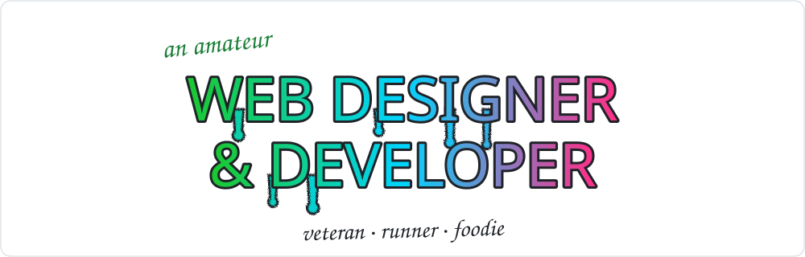

<!-- BANNER (regenerate with: python3 scripts/make_banner.py) -->
<picture>
  <source media="(prefers-color-scheme: dark)" srcset="assets/banner-dark.svg" />
  
</picture>

<!-- VISITOR COUNTER -->

  

 
<!-- TYPING SVG -->

  <a href="https://git.io/typing-svg">
    <picture>
      <source media="(prefers-color-scheme: dark)"
        srcset="https://readme-typing-svg.demolab.com?font=JetBrains+mono&weight=600&size=30&duration=3000&pause=500&color=1BC830&center=true&vCenter=true&random=false&width=435&lines=Hello%2C+World!+%F0%9F%91%8B%F0%9F%8F%BD;I'm+t3Rminal-cmd..." />
      
    </picture>
  </a>

 

<!-- HEADLINE (regenerate with: python3 scripts/make_graffiti.py) -->
<picture>
  <source media="(prefers-color-scheme: dark)" srcset="assets/headline-dark.svg" />
  
</picture>

<!-- CODING GIF -->

  

<!-- ABOUT ME (icons are made by scripts/make_graffiti.py) -->

  <table>
    <tr>
      <td></td>
      <td align="left"><b>Working on</b></td>
      <td align="left">A responsive portfolio</td>
    </tr>
    <tr>
      <td></td>
      <td align="left"><b>Learning</b></td>
      <td align="left">HTML · CSS · JavaScript · Python</td>
    </tr>
    <tr>
      <td></td>
      <td align="left"><b>Ask me about</b></td>
      <td align="left">Coffee, snowboarding or C4 energy drinks</td>
    </tr>
  </table>

<!-- FUN FACT (a new card every day, built by scripts/fun_fact.py) -->

  <picture>
    <source media="(prefers-color-scheme: dark)" srcset="https://raw.githubusercontent.com/t3rminal-cmd/t3rminal-cmd/output/fun-fact-dark.svg" />
    
  </picture>

<!-- MY STATS -->
<h3 align="center">My Stats:</h3>

  

    <picture>
      <source media="(prefers-color-scheme: dark)" srcset="https://raw.githubusercontent.com/t3rminal-cmd/t3rminal-cmd/output/top-langs-dark.svg" />
      
    </picture>
  

  

    <picture>
      <source media="(prefers-color-scheme: dark)" srcset="https://raw.githubusercontent.com/t3rminal-cmd/t3rminal-cmd/output/stats-dark.svg" />
      
    </picture>
  

<!-- CONTRIBUTION CHART (built by scripts/contrib_graph.py) -->
<h3 align="center">Contribution Activity:</h3>

  <picture>
    <source media="(prefers-color-scheme: dark)"
      srcset="https://raw.githubusercontent.com/t3rminal-cmd/t3rminal-cmd/output/contrib-dark.svg" />
    
  </picture>

<!-- CONNECT (icons are made by scripts/make_graffiti.py) -->
<h3 align="center">Connect with me:</h3>

  &nbsp;&nbsp;
  &nbsp;&nbsp;
  

